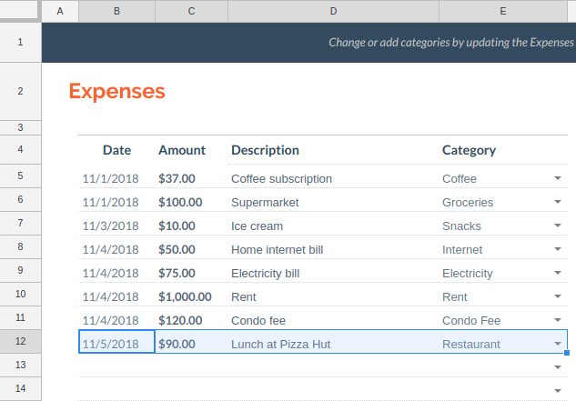

# google-budget
Append expense/income entries to your Google budget spreadsheet from the CLI.

## Preliminaries
 1. Create a *monthly budget* spreadsheet from the [spreadsheet template gallery](https://docs.google.com/spreadsheets/u/0/?ftv=1&folder=0ACoSgW1iveL-Uk9PVA) if you don't already have one.

 2. When the new sheet opens up, take note of your **`SPREADSHEET_ID`** in the page URL which looks like the following:
``` cmd
https://docs.google.com/spreadsheets/d/<SPREADSHEET_ID>/edit#gid=<SHEET_ID>
```

## Installation
 1. Complete steps 1 & 2 of the [quickstart guide](https://developers.google.com/sheets/api/quickstart/python). Make sure that you copy the **`credentials.json`** file into **project directory.**

 2. From project directory:
``` sh
chmod +x install.sh
./install.sh
```

## Uninstallation
From project directory:
``` sh
./uninstall.sh
```

## Usage
You can execute the **`budget`** command globally for spreadsheet selection and transaction entry.

### Spreadsheet Selection
``` sh
budget sheet <SPREADSHEET_ID>
```

### Transaction Entry
``` sh
# append expense
budget expense "<Date>,<Amount>,<Description>,<Category>"

# append income
budget income "<Date>,<Amount>,<Description>,<Category>"
```

#### Example
``` sh
budget expense "Nov 5 2018,90,Lunch at Pizza Hut,Restaurant"
```

