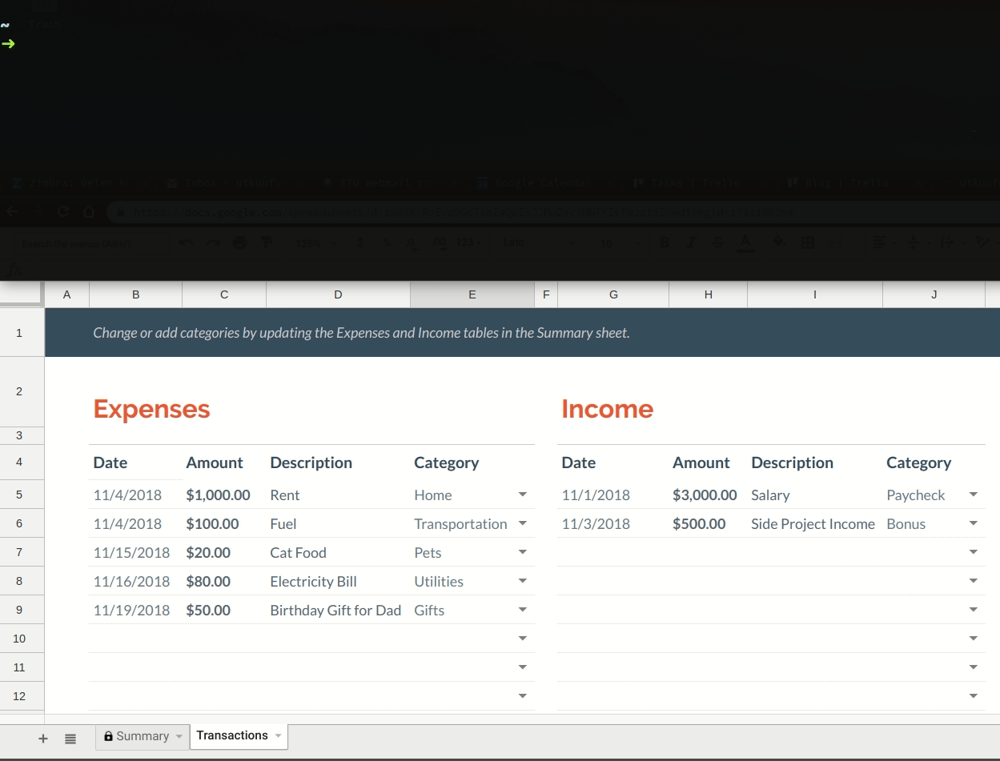

# budget-cli
 * **insert transaction entries**
 * **view transaction logs & summary**
 * **synchronize with annual budget**
 * **once-in-a-year configuration**



## Preliminaries
 1. Create *monthly budget* spreadsheets for each month from the [spreadsheet template gallery](https://docs.google.com/spreadsheets/u/0/?ftv=1&folder=0ACoSgW1iveL-Uk9PVA).

 2. Optionally, create an additional *annual budget* spreadsheet if you want to use the synchronization feature.

 3. Take note of the SPREADSHEET_IDs which is embedded inside the URL:
``` cmd
https://docs.google.com/spreadsheets/d/<SPREADSHEET_ID>/edit#gid=<SHEET_ID>
```

## Install
 1. Complete steps 1 & 2 of the [quickstart guide](https://developers.google.com/sheets/api/quickstart/python). Make sure that you copy the **`credentials.json`** file into **project directory.**

 2. Update spreadsheet IDs inside [config.json](config.json) with your own monthly budget spreadsheet IDs.

 3. From project directory:
``` sh
./install.sh
```
 
## Uninstall
``` sh
./uninstall.sh
```

## Usage
 * For `summary`, `categories`, `log` and `sync` commands, this month's spreadsheet will be used unless specified explicitly.

 * For `expense` and `income` commands, today's date will be assigned and this month's spreadsheet will be used unless a custom date is specified explicitly as the first argument of transaction parameters.

### Transaction Entry
``` sh
# append expense for custom date
budget expense "Jun 29, 40, Pizza, Food"

# append expense for today
budget expense "40, Pizza, Food"

# append income for custom date
budget income "Aug 2, 3000, Salary, Paycheck"

# append income for today
budget income "3000, Salary, Paycheck"
```

### Summary
``` sh
# print monthly budget summary for all months so far
budget summary

# print monthly budget summary for January
budget summary jan
```

### Categories
``` sh
# list all monthly budget categories & amounts for this month
budget categories

# list all monthly budget categories & amounts for February
budget categories feb
```

### Log
``` sh
# log monthly budget transaction history for this month
budget log

# log monthly budget transaction history for March
budget log mar
```

### Synchronization
 For annual synchronization, expense & income categories must be exactly the same across monthly and annual budget spreadsheets.

``` sh
# update annual budget with expenses & income of this month
budget sync

# update annual budget with expenses & income of April
budget sync apr
```